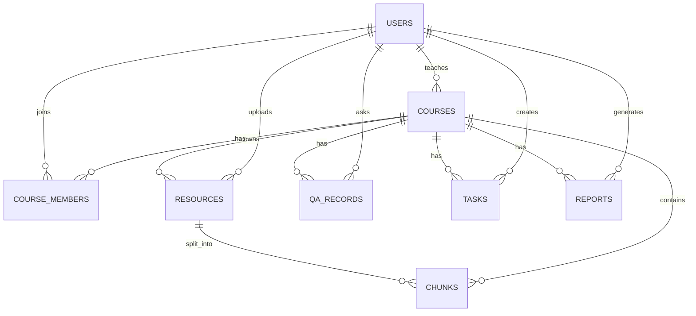
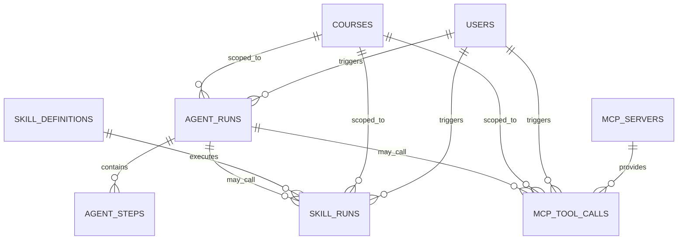

# 03 数据模型与数据库设计

> 项目名称：EduAgent 课程资源与教学任务智能体
> 文档类型：数据库模型、数据关系、Agent / Skills / MCP 审计数据设计文档
> 适用对象：CodeBuddy / AI 编程助手 / 后端开发 / 数据库开发 / Agent 开发 / MCP 开发 / Skills 开发 / 测试人员
> 对应代码：`backend/app/models/`、`backend/app/schemas/`、`backend/alembic/`、`backend/app/rag/`、`backend/app/agent/`、`backend/app/skills/`、`backend/app/mcp/`
> 文档版本：v2.0
> 优化日期：2026-06-10

------

## 1. 文档目的

本文档用于定义 EduAgent 项目的数据模型、表结构、字段设计、索引设计、外键关系、JSONB 字段约定、ChromaDB 向量数据结构，以及新版课程智能体平台所需的 Agent / Skills / MCP 执行审计数据模型。

新版 EduAgent 不再只是：

```text
课程管理系统 + RAG 知识库 + AI 问答
```

而是升级为：

```text
课程智能体平台
= 课程业务系统
+ RAG 知识库
+ MCP 工具生态
+ Skills 技能系统
+ Agent Orchestrator
+ 多智能体工作流
+ 执行审计
```

因此，数据库设计不仅要支持课程、资源、问答、任务和报告，还要支持：

1. Skill 定义。
2. Skill 执行记录。
3. MCP Server 配置。
4. MCP Tool 调用记录。
5. Agent 执行记录。
6. Agent 执行步骤记录。
7. 多轮对话 conversation_id。
8. RAG 引用来源追踪。
9. 权限隔离和审计。

------

## 2. 数据存储总体设计

EduAgent 使用多种存储组件协同工作。

| 存储组件     | 用途                                                         | 当前状态                       |
| ------------ | ------------------------------------------------------------ | ------------------------------ |
| PostgreSQL   | 业务数据、用户、课程、资源、问答、任务、报告、Agent / Skill / MCP 执行记录 | 核心数据库                     |
| ChromaDB     | 课程资料切片向量索引                                         | 已使用                         |
| Redis        | Celery Broker、缓存、对话记忆、临时状态                      | 已使用                         |
| 本地文件存储 | 保存上传文件                                                 | 当前主链路使用                 |
| MinIO        | 对象存储预留                                                 | 架构中存在，主链路需进一步统一 |
| 日志系统     | 记录 API、RAG、LLM、Agent、Skill、MCP 调用                   | 需要增强                       |

------

## 3. 数据库设计原则

### 3.1 课程级数据隔离

所有课程内业务数据必须绑定 `course_id`。

包括：

```text
resources
chunks
qa_records
tasks
reports
skill_runs
mcp_tool_calls
agent_runs
agent_steps
```

基本原则：

1. 学生只能访问自己加入课程的数据。
2. 教师只能管理自己课程的数据。
3. 管理员可根据管理权限访问全局数据。
4. Agent、Skill、MCP Tool 都不得跨课程访问数据。
5. 查询课程内数据时必须显式使用 `course_id` 过滤。

------

### 3.2 UUID 主键

所有核心业务表建议使用 UUID 主键。

当前项目使用：

```sql
gen_random_uuid()
```

注意：

PostgreSQL 需要启用 `pgcrypto` 扩展：

```sql
CREATE EXTENSION IF NOT EXISTS pgcrypto;
```

Alembic 初始迁移中应显式包含该语句，否则新数据库迁移时可能因 `gen_random_uuid()` 不存在而失败。

------

### 3.3 时间字段

通用时间字段：

```text
created_at
updated_at
```

要求：

1. `created_at` 使用数据库默认时间。
2. `updated_at` 在更新时自动变化。
3. 审计类表至少需要 `created_at`。
4. Agent / Skill / MCP 执行记录应记录执行耗时 `latency_ms`。

------

### 3.4 JSONB 字段

复杂结构建议使用 JSONB。

典型字段：

```text
qa_records.sources
tasks.reference_resources
reports.statistics
skill_definitions.allowed_roles
skill_definitions.input_schema
skill_definitions.output_schema
skill_runs.input_summary
skill_runs.output_summary
mcp_servers.allowed_roles
mcp_tool_calls.arguments_summary
mcp_tool_calls.result_summary
agent_runs.metadata
agent_steps.input_summary
agent_steps.output_summary
```

要求：

1. JSONB 字段必须有明确结构约定。
2. 不得将真实 API Key、JWT、密码、完整系统 Prompt 写入 JSONB。
3. 对可能查询的 JSONB 字段，应根据需要添加 GIN 索引。
4. 对大文本输出，不建议完整写入 JSONB，可保存摘要或引用 ID。

------

### 3.5 敏感数据保护

数据库中不得保存：

1. 明文密码。
2. 真实 API Key 明文。
3. JWT Secret。
4. 完整外部服务密钥。
5. 用户上传文件的服务器绝对路径。
6. 高敏感学生隐私全文。
7. 完整系统 Prompt。
8. 未脱敏的 MCP Tool 参数。

------

## 4. 实体关系总览

### 4.1 当前核心业务实体



------

### 4.2 新版智能体平台实体



------

### 4.3 总体数据关系

```text
User
 ├── CourseMember
 ├── Resource uploaded_by
 ├── QARecord
 ├── Task created_by
 ├── Report generated_by
 ├── AgentRun
 ├── SkillRun
 └── MCPToolCall

Course
 ├── CourseMember
 ├── Resource
 ├── Chunk
 ├── QARecord
 ├── Task
 ├── Report
 ├── AgentRun
 ├── SkillRun
 └── MCPToolCall

Resource
 └── Chunk
      └── ChromaDB vector record

AgentRun
 ├── AgentStep
 ├── SkillRun
 └── MCPToolCall
```

------

## 5. 枚举类型设计

### 5.1 已有业务枚举

| 枚举               | 取值                                                         | 说明         |
| ------------------ | ------------------------------------------------------------ | ------------ |
| `UserRole`         | `student` / `teacher` / `admin`                              | 用户系统角色 |
| `CourseStatus`     | `active` / `archived`                                        | 课程状态     |
| `CourseMemberRole` | `student` / `teacher`                                        | 课程内角色   |
| `ResourceFileType` | `pdf` / `docx` / `pptx` / `md` / `txt` / `xlsx`              | 资源文件类型 |
| `ResourceStatus`   | `uploading` / `parsing` / `chunking` / `embedding` / `ready` / `failed` | 资源处理状态 |
| `QAFeedback`       | `none` / `like` / `dislike`                                  | 问答反馈     |
| `TaskType`         | `class_exercise` / `homework` / `lab_guide`                  | 教学任务类型 |
| `TaskDifficulty`   | `easy` / `medium` / `hard`                                   | 任务难度     |
| `TaskStatus`       | `draft` / `published` / `archived`                           | 任务状态     |
| `ReportType`       | `weekly` / `monthly` / `semester`                            | 报告类型     |

------

### 5.2 新增智能体平台枚举

建议新增：

| 枚举                | 取值                                                         | 说明                |
| ------------------- | ------------------------------------------------------------ | ------------------- |
| `SkillStatus`       | `enabled` / `disabled`                                       | Skill 启用状态      |
| `RunStatus`         | `pending` / `running` / `success` / `failed` / `cancelled`   | 执行状态            |
| `MCPTransportType`  | `internal` / `stdio` / `http` / `sse`                        | MCP Server 连接方式 |
| `AgentType`         | `course_qa` / `resource_analysis` / `task_generation` / `report_generation` / `code_tutor` / `lesson_design` / `study_path` / `admin_analysis` | Agent 类型          |
| `AgentIntent`       | `course_qa` / `resource_summary` / `resource_analysis` / `task_generation` / `quiz_generation` / `lab_guide_generation` / `report_generation` / `code_explanation` / `code_debugging` / `lesson_design` / `study_path` / `admin_analysis` / `general_help` / `unknown` | 用户意图            |
| `MCPToolCallStatus` | `pending` / `running` / `success` / `failed` / `timeout` / `denied` | MCP Tool 调用状态   |

------

## 6. 当前核心表结构

------

# 6.1 users 用户表

表名：

```text
users
```

用途：

保存系统用户信息。

字段设计：

| 字段            | 类型      | 约束             | 说明                            |
| --------------- | --------- | ---------------- | ------------------------------- |
| `id`            | UUID      | PK               | 用户 ID                         |
| `username`      | VARCHAR   | UNIQUE, NOT NULL | 用户名                          |
| `email`         | VARCHAR   | UNIQUE, NOT NULL | 邮箱                            |
| `password_hash` | VARCHAR   | NOT NULL         | 密码哈希                        |
| `role`          | ENUM      | NOT NULL         | `student` / `teacher` / `admin` |
| `display_name`  | VARCHAR   | NULL             | 显示名称                        |
| `is_active`     | BOOLEAN   | NOT NULL         | 是否启用                        |
| `created_at`    | TIMESTAMP | NOT NULL         | 创建时间                        |
| `updated_at`    | TIMESTAMP | NOT NULL         | 更新时间                        |

索引：

```text
idx_users_username
idx_users_email
idx_users_role
```

安全要求：

1. 不保存明文密码。
2. 管理员不能通过 API 查看密码哈希。
3. 禁用用户不能继续访问系统。

------

# 6.2 courses 课程表

表名：

```text
courses
```

用途：

保存课程基础信息。

字段设计：

| 字段          | 类型      | 约束             | 说明                  |
| ------------- | --------- | ---------------- | --------------------- |
| `id`          | UUID      | PK               | 课程 ID               |
| `name`        | VARCHAR   | NOT NULL         | 课程名称              |
| `code`        | VARCHAR   | UNIQUE, NOT NULL | 课程码                |
| `description` | TEXT      | NULL             | 课程描述              |
| `semester`    | VARCHAR   | NULL             | 学期                  |
| `teacher_id`  | UUID      | FK users.id      | 创建教师              |
| `cover_image` | VARCHAR   | NULL             | 封面图                |
| `status`      | ENUM      | NOT NULL         | `active` / `archived` |
| `created_at`  | TIMESTAMP | NOT NULL         | 创建时间              |
| `updated_at`  | TIMESTAMP | NOT NULL         | 更新时间              |

索引：

```text
idx_courses_teacher
idx_courses_status
```

约束：

1. `code` 必须唯一。
2. 删除教师时课程如何处理需要明确策略。
3. 当前建议：教师删除应受限，不建议直接级联删除课程。

------

# 6.3 course_members 课程成员表

表名：

```text
course_members
```

用途：

保存用户与课程的成员关系。

字段设计：

| 字段        | 类型      | 约束          | 说明        |
| ----------- | --------- | ------------- | ----------- |
| `id`        | UUID      | PK            | 成员关系 ID |
| `course_id` | UUID      | FK courses.id | 课程 ID     |
| `user_id`   | UUID      | FK users.id   | 用户 ID     |
| `role`      | ENUM      | NOT NULL      | 课程内角色  |
| `joined_at` | TIMESTAMP | NOT NULL      | 加入时间    |

唯一约束：

```text
course_id + user_id
```

索引：

```text
idx_cm_user
idx_cm_course
```

权限意义：

1. 所有课程内接口必须校验该表。
2. 教师管理课程成员时也应校验自己是否为课程教师。
3. 管理员可绕过课程成员限制，但必须有审计。

------

# 6.4 resources 课程资源表

表名：

```text
resources
```

用途：

保存课程上传资料的元信息和处理状态。

字段设计：

| 字段            | 类型      | 约束          | 说明         |
| --------------- | --------- | ------------- | ------------ |
| `id`            | UUID      | PK            | 资源 ID      |
| `course_id`     | UUID      | FK courses.id | 所属课程     |
| `file_name`     | VARCHAR   | NOT NULL      | 原始文件名   |
| `file_type`     | ENUM      | NOT NULL      | 文件类型     |
| `file_size`     | BIGINT    | NOT NULL      | 文件大小     |
| `file_url`      | VARCHAR   | NOT NULL      | 文件访问路径 |
| `summary`       | TEXT      | NULL          | 资源摘要     |
| `status`        | ENUM      | NOT NULL      | 处理状态     |
| `chunk_count`   | INTEGER   | DEFAULT 0     | 切片数量     |
| `error_message` | TEXT      | NULL          | 失败原因     |
| `uploaded_by`   | UUID      | FK users.id   | 上传用户     |
| `created_at`    | TIMESTAMP | NOT NULL      | 创建时间     |

索引：

```text
idx_resources_course
idx_resources_status
idx_resources_type
```

当前需要修复：

1. ORM 中 `uploaded_by` 与 Alembic 迁移的 nullable 设置需要统一。
2. 如果外键使用 `ON DELETE SET NULL`，则 `uploaded_by` 应允许为空。
3. `file_url` 不应只写成 MinIO 路径，因为当前主链路可能是本地 `/files/resources/...`。

建议新增字段：

| 字段              | 类型    | 说明                   |
| ----------------- | ------- | ---------------------- |
| `analysis_status` | VARCHAR | 资源分析状态，后续可选 |
| `analysis_result` | JSONB   | 资源分析结果，后续可选 |

也可以独立建立 `resource_analysis_results` 表，避免 resources 表过大。

------

# 6.5 chunks 文档切片表

表名：

```text
chunks
```

用途：

保存课程资源解析后的文本切片，并与 ChromaDB 向量记录关联。

字段设计：

| 字段          | 类型      | 约束            | 说明             |
| ------------- | --------- | --------------- | ---------------- |
| `id`          | UUID      | PK              | 切片 ID          |
| `resource_id` | UUID      | FK resources.id | 所属资源         |
| `course_id`   | UUID      | FK courses.id   | 所属课程         |
| `chunk_index` | INTEGER   | NOT NULL        | 切片编号         |
| `content`     | TEXT      | NOT NULL        | 切片文本         |
| `token_count` | INTEGER   | NULL            | token 数         |
| `chroma_id`   | VARCHAR   | UNIQUE          | ChromaDB 向量 ID |
| `created_at`  | TIMESTAMP | NOT NULL        | 创建时间         |

索引：

```text
idx_chunks_resource
idx_chunks_course
idx_chunks_chroma_id
```

要求：

1. 每个 chunk 必须绑定 `course_id`。
2. 每个 chunk 必须可追溯到 resource。
3. 删除 resource 时应删除 chunks 和 ChromaDB 向量。
4. RAG 检索结果返回时应能关联到资源名称和 chunk_index。

------

# 6.6 qa_records 问答记录表

表名：

```text
qa_records
```

用途：

保存课程问答记录。

当前字段设计：

| 字段         | 类型      | 约束          | 说明                        |
| ------------ | --------- | ------------- | --------------------------- |
| `id`         | UUID      | PK            | 问答记录 ID                 |
| `course_id`  | UUID      | FK courses.id | 所属课程                    |
| `user_id`    | UUID      | FK users.id   | 提问用户                    |
| `question`   | TEXT      | NOT NULL      | 问题                        |
| `answer`     | TEXT      | NOT NULL      | 回答                        |
| `sources`    | JSONB     | NULL          | 引用来源                    |
| `feedback`   | ENUM      | NOT NULL      | `none` / `like` / `dislike` |
| `created_at` | TIMESTAMP | NOT NULL      | 创建时间                    |

建议新增字段：

| 字段              | 类型           | 说明                             |
| ----------------- | -------------- | -------------------------------- |
| `conversation_id` | UUID / VARCHAR | 会话 ID                          |
| `agent_run_id`    | UUID           | 对应 Agent 执行记录，可选        |
| `metadata`        | JSONB          | 模型、耗时、检索数量等摘要，可选 |

索引：

```text
idx_qa_course
idx_qa_user
idx_qa_created
idx_qa_conversation
idx_qa_course_user_created
```

`sources` 结构建议：

```json
[
  {
    "resource_id": "uuid",
    "resource_name": "Python基础.pdf",
    "chunk_id": "uuid",
    "chunk_index": 3,
    "score": 0.91,
    "text_preview": "引用片段..."
  }
]
```

当前必须修复：

1. Schema / Service 支持 `conversation_id`，但数据库表缺少该字段。
2. ORM 中 `sources` 类型标注应体现数组语义。
3. 多轮对话历史必须可按 `conversation_id` 查询。

------

# 6.7 tasks 教学任务表

表名：

```text
tasks
```

用途：

保存 AI 生成或教师编辑的教学任务。

字段设计：

| 字段                  | 类型      | 约束          | 说明                         |
| --------------------- | --------- | ------------- | ---------------------------- |
| `id`                  | UUID      | PK            | 任务 ID                      |
| `course_id`           | UUID      | FK courses.id | 所属课程                     |
| `title`               | VARCHAR   | NOT NULL      | 任务标题                     |
| `task_type`           | ENUM      | NOT NULL      | 任务类型                     |
| `topic`               | VARCHAR   | NOT NULL      | 主题                         |
| `content`             | TEXT      | NOT NULL      | Markdown 任务内容            |
| `difficulty`          | ENUM      | NOT NULL      | 难度                         |
| `estimated_time`      | VARCHAR   | NULL          | 预计耗时                     |
| `reference_resources` | JSONB     | NULL          | 参考资源                     |
| `status`              | ENUM      | NOT NULL      | draft / published / archived |
| `created_by`          | UUID      | FK users.id   | 创建者                       |
| `created_at`          | TIMESTAMP | NOT NULL      | 创建时间                     |
| `updated_at`          | TIMESTAMP | NOT NULL      | 更新时间                     |

建议新增字段：

| 字段           | 类型 | 说明                       |
| -------------- | ---- | -------------------------- |
| `skill_run_id` | UUID | 由哪个 SkillRun 生成，可选 |
| `agent_run_id` | UUID | 由哪个 AgentRun 生成，可选 |

`reference_resources` 结构建议：

```json
[
  {
    "resource_id": "uuid",
    "resource_name": "Python基础.pdf",
    "chunk_id": "uuid",
    "chunk_index": 3,
    "score": 0.88,
    "text_preview": "引用片段..."
  }
]
```

索引：

```text
idx_tasks_course
idx_tasks_status
idx_tasks_type
idx_tasks_created_by
```

------

# 6.8 reports 教学报告表

表名：

```text
reports
```

用途：

保存课程教学报告。

字段设计：

| 字段           | 类型      | 约束          | 说明                        |
| -------------- | --------- | ------------- | --------------------------- |
| `id`           | UUID      | PK            | 报告 ID                     |
| `course_id`    | UUID      | FK courses.id | 所属课程                    |
| `report_type`  | ENUM      | NOT NULL      | weekly / monthly / semester |
| `start_date`   | DATE      | NOT NULL      | 开始日期                    |
| `end_date`     | DATE      | NOT NULL      | 结束日期                    |
| `title`        | VARCHAR   | NOT NULL      | 报告标题                    |
| `content`      | TEXT      | NOT NULL      | Markdown 报告正文           |
| `statistics`   | JSONB     | NULL          | 结构化统计数据              |
| `generated_by` | UUID      | FK users.id   | 生成者                      |
| `created_at`   | TIMESTAMP | NOT NULL      | 创建时间                    |

建议新增字段：

| 字段           | 类型 | 说明                       |
| -------------- | ---- | -------------------------- |
| `skill_run_id` | UUID | 由哪个 SkillRun 生成，可选 |
| `agent_run_id` | UUID | 由哪个 AgentRun 生成，可选 |

`statistics` 结构建议：

```json
{
  "total_tasks": 5,
  "published_tasks": 3,
  "total_qa": 42,
  "active_students": 18,
  "total_resources": 12,
  "new_resources": 2,
  "top_questions": [
    {
      "question": "列表推导式是什么意思？",
      "count": 6
    }
  ],
  "suggestions": [
    "建议增加列表推导式相关练习"
  ]
}
```

索引：

```text
idx_reports_course
idx_reports_dates
idx_reports_generated_by
```

------

## 7. 新增智能体平台表设计

------

# 7.1 skill_definitions 技能定义表

表名：

```text
skill_definitions
```

用途：

保存系统内置或自定义 Skill 的元数据。

字段设计：

| 字段            | 类型      | 约束             | 说明           |
| --------------- | --------- | ---------------- | -------------- |
| `id`            | UUID      | PK               | Skill 定义 ID  |
| `name`          | VARCHAR   | UNIQUE, NOT NULL | Skill 唯一名称 |
| `display_name`  | VARCHAR   | NOT NULL         | 中文显示名称   |
| `description`   | TEXT      | NULL             | 技能描述       |
| `version`       | VARCHAR   | NOT NULL         | 版本号         |
| `enabled`       | BOOLEAN   | NOT NULL         | 是否启用       |
| `allowed_roles` | JSONB     | NOT NULL         | 允许的系统角色 |
| `input_schema`  | JSONB     | NOT NULL         | 输入 Schema    |
| `output_schema` | JSONB     | NOT NULL         | 输出 Schema    |
| `created_at`    | TIMESTAMP | NOT NULL         | 创建时间       |
| `updated_at`    | TIMESTAMP | NOT NULL         | 更新时间       |

推荐 Skill 名称：

```text
course_qa
resource_analysis
task_generation
report_generation
code_explanation
lesson_design
quiz_generation
study_path
```

`allowed_roles` 示例：

```json
["student", "teacher", "admin"]
```

`input_schema` 示例：

```json
{
  "type": "object",
  "properties": {
    "question": {
      "type": "string"
    }
  },
  "required": ["question"]
}
```

索引：

```text
idx_skill_definitions_name
idx_skill_definitions_enabled
```

说明：

1. 内置 Skill 也可以只通过代码注册，不一定必须写入该表。
2. 如果需要后台管理 Skill 启用状态，建议使用该表。
3. 自定义 Skill 必须写入该表并经过管理员启用。

------

# 7.2 skill_runs 技能执行记录表

表名：

```text
skill_runs
```

用途：

记录每次 Skill 执行。

字段设计：

| 字段             | 类型           | 约束                   | 说明                                             |
| ---------------- | -------------- | ---------------------- | ------------------------------------------------ |
| `id`             | UUID           | PK                     | Skill 执行 ID                                    |
| `skill_name`     | VARCHAR        | NOT NULL               | Skill 名称                                       |
| `user_id`        | UUID           | FK users.id            | 调用用户                                         |
| `course_id`      | UUID           | FK courses.id, NULL    | 所属课程                                         |
| `agent_run_id`   | UUID           | FK agent_runs.id, NULL | 所属 Agent 执行                                  |
| `input_summary`  | JSONB          | NULL                   | 输入摘要                                         |
| `output_summary` | JSONB          | NULL                   | 输出摘要                                         |
| `status`         | ENUM / VARCHAR | NOT NULL               | pending / running / success / failed / cancelled |
| `latency_ms`     | INTEGER        | NULL                   | 耗时                                             |
| `error_message`  | TEXT           | NULL                   | 错误信息                                         |
| `created_at`     | TIMESTAMP      | NOT NULL               | 创建时间                                         |

索引：

```text
idx_skill_runs_skill_name
idx_skill_runs_user
idx_skill_runs_course
idx_skill_runs_agent_run
idx_skill_runs_status
idx_skill_runs_created
```

`input_summary` 注意：

1. 只保存摘要。
2. 不保存完整 API Key。
3. 不保存完整系统 Prompt。
4. 不保存敏感学生隐私全文。

示例：

```json
{
  "topic": "Python 函数",
  "task_type": "homework",
  "difficulty": "medium"
}
```

------

# 7.3 mcp_servers MCP Server 配置表

表名：

```text
mcp_servers
```

用途：

保存 MCP Server 配置和启用状态。

字段设计：

| 字段            | 类型           | 约束             | 说明                          |
| --------------- | -------------- | ---------------- | ----------------------------- |
| `id`            | UUID           | PK               | MCP Server ID                 |
| `name`          | VARCHAR        | UNIQUE, NOT NULL | Server 名称                   |
| `description`   | TEXT           | NULL             | 描述                          |
| `transport`     | ENUM / VARCHAR | NOT NULL         | internal / stdio / http / sse |
| `endpoint`      | VARCHAR        | NULL             | Server 地址或内部标识         |
| `enabled`       | BOOLEAN        | NOT NULL         | 是否启用                      |
| `allowed_roles` | JSONB          | NOT NULL         | 允许角色                      |
| `config`        | JSONB          | NULL             | 非敏感配置                    |
| `created_at`    | TIMESTAMP      | NOT NULL         | 创建时间                      |
| `updated_at`    | TIMESTAMP      | NOT NULL         | 更新时间                      |

推荐内置 Server：

```text
rag_search
course_db
file_resource
report_analysis
code_sandbox
```

`config` 不能保存真实密钥。

索引：

```text
idx_mcp_servers_name
idx_mcp_servers_enabled
idx_mcp_servers_transport
```

------

# 7.4 mcp_tool_calls MCP 工具调用记录表

表名：

```text
mcp_tool_calls
```

用途：

记录每次 MCP Tool 调用。

字段设计：

| 字段                | 类型           | 约束                   | 说明                                                    |
| ------------------- | -------------- | ---------------------- | ------------------------------------------------------- |
| `id`                | UUID           | PK                     | 调用 ID                                                 |
| `server_name`       | VARCHAR        | NOT NULL               | MCP Server 名称                                         |
| `tool_name`         | VARCHAR        | NOT NULL               | Tool 名称                                               |
| `user_id`           | UUID           | FK users.id            | 调用用户                                                |
| `course_id`         | UUID           | FK courses.id, NULL    | 所属课程                                                |
| `agent_run_id`      | UUID           | FK agent_runs.id, NULL | 所属 Agent 执行                                         |
| `skill_run_id`      | UUID           | FK skill_runs.id, NULL | 所属 Skill 执行                                         |
| `arguments_summary` | JSONB          | NULL                   | 参数摘要                                                |
| `result_summary`    | JSONB          | NULL                   | 结果摘要                                                |
| `status`            | ENUM / VARCHAR | NOT NULL               | pending / running / success / failed / timeout / denied |
| `latency_ms`        | INTEGER        | NULL                   | 耗时                                                    |
| `error_message`     | TEXT           | NULL                   | 错误信息                                                |
| `created_at`        | TIMESTAMP      | NOT NULL               | 创建时间                                                |

索引：

```text
idx_mcp_calls_server_tool
idx_mcp_calls_user
idx_mcp_calls_course
idx_mcp_calls_agent_run
idx_mcp_calls_skill_run
idx_mcp_calls_status
idx_mcp_calls_created
```

`arguments_summary` 示例：

```json
{
  "query": "Python 函数",
  "top_k": 5
}
```

禁止保存：

1. 原始 SQL。
2. 真实文件绝对路径。
3. API Key。
4. 用户密码。
5. JWT。
6. 完整私密数据。

------

# 7.5 agent_runs Agent 执行记录表

表名：

```text
agent_runs
```

用途：

记录每次 Agent 执行。

字段设计：

| 字段              | 类型           | 约束                | 说明                                             |
| ----------------- | -------------- | ------------------- | ------------------------------------------------ |
| `id`              | UUID           | PK                  | Agent 执行 ID                                    |
| `agent_type`      | VARCHAR        | NOT NULL            | Agent 类型                                       |
| `user_id`         | UUID           | FK users.id         | 触发用户                                         |
| `course_id`       | UUID           | FK courses.id, NULL | 所属课程                                         |
| `conversation_id` | UUID / VARCHAR | NULL                | 会话 ID                                          |
| `intent`          | VARCHAR        | NULL                | 用户意图                                         |
| `selected_skill`  | VARCHAR        | NULL                | 选中的 Skill                                     |
| `status`          | ENUM / VARCHAR | NOT NULL            | pending / running / success / failed / cancelled |
| `step_count`      | INTEGER        | DEFAULT 0           | 执行步骤数                                       |
| `latency_ms`      | INTEGER        | NULL                | 总耗时                                           |
| `error_message`   | TEXT           | NULL                | 错误信息                                         |
| `metadata`        | JSONB          | NULL                | 执行摘要                                         |
| `created_at`      | TIMESTAMP      | NOT NULL            | 创建时间                                         |
| `updated_at`      | TIMESTAMP      | NULL                | 更新时间                                         |

索引：

```text
idx_agent_runs_agent_type
idx_agent_runs_user
idx_agent_runs_course
idx_agent_runs_conversation
idx_agent_runs_intent
idx_agent_runs_status
idx_agent_runs_created
```

`agent_type` 推荐取值：

```text
course_qa
resource_analysis
task_generation
report_generation
code_tutor
lesson_design
study_path
admin_analysis
```

`metadata` 示例：

```json
{
  "model": "deepseek-chat",
  "retrieved_doc_count": 8,
  "tool_call_count": 2,
  "skill_call_count": 1
}
```

------

# 7.6 agent_steps Agent 执行步骤表

表名：

```text
agent_steps
```

用途：

记录 Agent 执行过程中的每一步。

字段设计：

| 字段             | 类型           | 约束             | 说明                                           |
| ---------------- | -------------- | ---------------- | ---------------------------------------------- |
| `id`             | UUID           | PK               | 步骤 ID                                        |
| `agent_run_id`   | UUID           | FK agent_runs.id | 所属 Agent 执行                                |
| `step_index`     | INTEGER        | NOT NULL         | 步骤序号                                       |
| `step_name`      | VARCHAR        | NOT NULL         | 步骤名称                                       |
| `skill_name`     | VARCHAR        | NULL             | 关联 Skill                                     |
| `tool_name`      | VARCHAR        | NULL             | 关联 Tool                                      |
| `input_summary`  | JSONB          | NULL             | 输入摘要                                       |
| `output_summary` | JSONB          | NULL             | 输出摘要                                       |
| `status`         | ENUM / VARCHAR | NOT NULL         | pending / running / success / failed / skipped |
| `latency_ms`     | INTEGER        | NULL             | 耗时                                           |
| `error_message`  | TEXT           | NULL             | 错误信息                                       |
| `created_at`     | TIMESTAMP      | NOT NULL         | 创建时间                                       |

索引：

```text
idx_agent_steps_run
idx_agent_steps_run_index
idx_agent_steps_status
```

示例步骤：

```text
load_context
input_guardrail
intent_classify
plan_task
select_skill
select_tool
call_mcp_tool
execute_skill
call_llm
output_guardrail
persist_result
```

------

## 8. 可选扩展表

以下表不是第一阶段必须实现，但建议后续考虑。

------

# 8.1 resource_analysis_results 资源分析结果表

用途：

保存 ResourceAnalysisAgent 的分析结果。

字段建议：

| 字段                   | 类型      | 说明          |
| ---------------------- | --------- | ------------- |
| `id`                   | UUID      | 主键          |
| `resource_id`          | UUID      | 资源 ID       |
| `course_id`            | UUID      | 课程 ID       |
| `summary`              | TEXT      | 资源摘要      |
| `knowledge_points`     | JSONB     | 知识点列表    |
| `difficulty_level`     | VARCHAR   | 难度          |
| `missing_topics`       | JSONB     | 缺失内容      |
| `duplicate_topics`     | JSONB     | 重复内容      |
| `teaching_suggestions` | JSONB     | 教学建议      |
| `skill_run_id`         | UUID      | 对应 SkillRun |
| `created_at`           | TIMESTAMP | 创建时间      |

------

# 8.2 study_path_records 学习路径记录表

用途：

保存学生学习路径推荐结果。

字段建议：

| 字段                    | 类型      | 说明          |
| ----------------------- | --------- | ------------- |
| `id`                    | UUID      | 主键          |
| `course_id`             | UUID      | 课程 ID       |
| `user_id`               | UUID      | 学生 ID       |
| `target_topic`          | VARCHAR   | 目标知识点    |
| `current_level`         | VARCHAR   | 当前水平      |
| `weak_points`           | JSONB     | 薄弱点        |
| `recommended_resources` | JSONB     | 推荐资源      |
| `learning_steps`        | JSONB     | 学习步骤      |
| `practice_suggestions`  | JSONB     | 练习建议      |
| `skill_run_id`          | UUID      | 对应 SkillRun |
| `created_at`            | TIMESTAMP | 创建时间      |

------

# 8.3 lesson_designs 教学设计表

用途：

保存 LessonDesignAgent 生成的教学设计。

字段建议：

| 字段                  | 类型      | 说明                         |
| --------------------- | --------- | ---------------------------- |
| `id`                  | UUID      | 主键                         |
| `course_id`           | UUID      | 课程 ID                      |
| `title`               | VARCHAR   | 教学设计标题                 |
| `topic`               | VARCHAR   | 教学主题                     |
| `duration_minutes`    | INTEGER   | 课时                         |
| `student_level`       | VARCHAR   | 学生水平                     |
| `content`             | TEXT      | Markdown 教学设计            |
| `reference_resources` | JSONB     | 参考资源                     |
| `created_by`          | UUID      | 创建者                       |
| `skill_run_id`        | UUID      | 对应 SkillRun                |
| `status`              | VARCHAR   | draft / published / archived |
| `created_at`          | TIMESTAMP | 创建时间                     |
| `updated_at`          | TIMESTAMP | 更新时间                     |

------

## 9. ChromaDB 向量数据设计

### 9.1 Collection 命名

每门课程一个 collection：

```text
course_{course_id}
```

其中 UUID 中的 `-` 可以替换为 `_`，避免 collection 命名兼容问题。

示例：

```text
course_8f3e2a1b_5c4d_4d2e_9a91_123456789abc
```

------

### 9.2 ChromaDB Metadata

每条向量记录建议保存：

```json
{
  "course_id": "uuid",
  "resource_id": "uuid",
  "resource_name": "Python基础.pdf",
  "chunk_id": "uuid",
  "chunk_index": 3,
  "file_type": "pdf",
  "created_at": "2026-06-10T10:00:00"
}
```

要求：

1. 必须保存 `course_id`。
2. 必须保存 `resource_id`。
3. 必须保存 `chunk_id`。
4. 必须能回查 PostgreSQL `chunks` 表。
5. 不保存敏感信息。
6. 删除资源时必须删除对应向量。

------

### 9.3 PostgreSQL 与 ChromaDB 对应关系

```text
chunks.id          → chunk_id
chunks.chroma_id   → ChromaDB record id
resources.id       → metadata.resource_id
courses.id         → metadata.course_id
```

------

## 10. JSONB 字段结构约定

### 10.1 qa_records.sources

```json
[
  {
    "resource_id": "uuid",
    "resource_name": "Python基础.pdf",
    "chunk_id": "uuid",
    "chunk_index": 3,
    "score": 0.91,
    "text_preview": "引用片段..."
  }
]
```

------

### 10.2 tasks.reference_resources

```json
[
  {
    "resource_id": "uuid",
    "resource_name": "Python基础.pdf",
    "chunk_id": "uuid",
    "chunk_index": 3,
    "score": 0.88,
    "text_preview": "引用片段..."
  }
]
```

------

### 10.3 reports.statistics

```json
{
  "total_tasks": 5,
  "published_tasks": 3,
  "total_qa": 42,
  "active_students": 18,
  "total_resources": 12,
  "new_resources": 2,
  "top_questions": [
    {
      "question": "列表推导式是什么意思？",
      "count": 6
    }
  ],
  "suggestions": [
    "建议增加列表推导式相关练习"
  ]
}
```

------

### 10.4 skill_runs.input_summary

```json
{
  "topic": "Python 函数",
  "task_type": "homework",
  "difficulty": "medium"
}
```

------

### 10.5 skill_runs.output_summary

```json
{
  "title": "课后作业：Python 函数",
  "content_length": 3200,
  "reference_count": 5
}
```

------

### 10.6 mcp_tool_calls.arguments_summary

```json
{
  "query": "Python 函数",
  "top_k": 5
}
```

------

### 10.7 mcp_tool_calls.result_summary

```json
{
  "result_count": 5,
  "status": "success"
}
```

------

### 10.8 agent_runs.metadata

```json
{
  "model": "deepseek-chat",
  "intent_confidence": 0.94,
  "retrieved_doc_count": 8,
  "tool_call_count": 2,
  "skill_call_count": 1,
  "guardrail_passed": true
}
```

------

## 11. 索引设计汇总

### 11.1 当前业务表索引

| 表             | 推荐索引                                        |
| -------------- | ----------------------------------------------- |
| users          | username、email、role                           |
| courses        | teacher_id、status、code                        |
| course_members | course_id、user_id、course_id + user_id         |
| resources      | course_id、status、file_type                    |
| chunks         | resource_id、course_id、chroma_id               |
| qa_records     | course_id、user_id、created_at、conversation_id |
| tasks          | course_id、status、task_type、created_by        |
| reports        | course_id、start_date、end_date、generated_by   |

------

### 11.2 智能体平台表索引

| 表                | 推荐索引                                                     |
| ----------------- | ------------------------------------------------------------ |
| skill_definitions | name、enabled                                                |
| skill_runs        | skill_name、user_id、course_id、agent_run_id、status、created_at |
| mcp_servers       | name、enabled、transport                                     |
| mcp_tool_calls    | server_name + tool_name、user_id、course_id、agent_run_id、skill_run_id、status、created_at |
| agent_runs        | agent_type、user_id、course_id、conversation_id、intent、status、created_at |
| agent_steps       | agent_run_id、agent_run_id + step_index、status              |

------

## 12. 外键与删除策略

### 12.1 当前业务数据删除

| 父表      | 子表                  | 删除策略建议                     |
| --------- | --------------------- | -------------------------------- |
| users     | course_members        | CASCADE                          |
| users     | resources.uploaded_by | SET NULL                         |
| users     | qa_records            | SET NULL 或 RESTRICT，按产品策略 |
| users     | tasks.created_by      | SET NULL                         |
| users     | reports.generated_by  | SET NULL                         |
| courses   | course_members        | CASCADE                          |
| courses   | resources             | CASCADE                          |
| courses   | chunks                | CASCADE                          |
| courses   | qa_records            | CASCADE                          |
| courses   | tasks                 | CASCADE                          |
| courses   | reports               | CASCADE                          |
| resources | chunks                | CASCADE                          |

------

### 12.2 Agent / Skill / MCP 删除策略

| 父表              | 子表           | 删除策略建议                     |
| ----------------- | -------------- | -------------------------------- |
| users             | agent_runs     | SET NULL 或保留 user_id 快照     |
| courses           | agent_runs     | CASCADE 或保留审计，按策略       |
| agent_runs        | agent_steps    | CASCADE                          |
| agent_runs        | skill_runs     | SET NULL                         |
| agent_runs        | mcp_tool_calls | SET NULL                         |
| skill_definitions | skill_runs     | 不建议物理外键，可用 skill_name  |
| mcp_servers       | mcp_tool_calls | 不建议物理外键，可用 server_name |

说明：

1. 审计记录通常不应随配置删除而消失。
2. `skill_runs.skill_name` 和 `mcp_tool_calls.server_name` 可用字符串快照保留历史。
3. 如果平台要求严格合规审计，Agent / Skill / MCP 记录应尽量保留。

------

## 13. 数据库迁移要求

### 13.1 迁移工具

使用 Alembic。

目录：

```text
backend/alembic/
```

------

### 13.2 每次数据库变更要求

每次修改数据库模型必须：

1. 修改 SQLAlchemy Model。
2. 修改 Pydantic Schema。
3. 新增 Alembic 迁移。
4. 检查外键和索引。
5. 检查默认值。
6. 检查 nullable。
7. 更新本文档。
8. 更新 API 文档。
9. 更新测试用例。

------

### 13.3 智能体平台迁移顺序

推荐迁移顺序：

```text
1. 修复 pgcrypto 扩展
2. 修复 Resource.uploaded_by nullable
3. 新增 qa_records.conversation_id
4. 新增 agent_runs
5. 新增 agent_steps
6. 新增 skill_definitions
7. 新增 skill_runs
8. 新增 mcp_servers
9. 新增 mcp_tool_calls
```

------

## 14. 当前代码与数据库设计不一致点

### 14.1 Resource.uploaded_by 可空性不一致

当前问题：

1. ORM 中 `uploaded_by` 可能是 `nullable=False`。
2. Alembic 迁移可能是 `nullable=True`。
3. 外键策略可能是 `ON DELETE SET NULL`。

建议：

```text
统一为 nullable=True，并保留 ON DELETE SET NULL。
```

------

### 14.2 qa_records 缺少 conversation_id

当前问题：

1. API / Service 中使用 `conversation_id`。
2. 数据库表没有 `conversation_id`。
3. 多轮历史查询不完整。

建议新增：

```text
conversation_id UUID 或 VARCHAR
```

并添加索引：

```text
idx_qa_conversation
idx_qa_course_user_conversation
```

------

### 14.3 JSONB 字段类型标注不准确

当前问题：

1. `qa_records.sources` 实际保存数组。
2. `tasks.reference_resources` 实际保存数组。
3. ORM 类型标注可能写成 dict。

建议：

1. 代码中语义上使用 `list[dict]`。
2. Pydantic Schema 中也使用 `list[...]`。
3. 文档统一为数组结构。

------

### 14.4 ResourceFileType 包含 xlsx 但解析器不完整

当前问题：

1. 配置和枚举允许 `xlsx`。
2. parser 当前可能不支持 xlsx。

处理方式二选一：

```text
方案 A：补充 xlsx 解析器。
方案 B：暂时移除 xlsx 支持。
```

前端、后端配置、API 文档必须保持一致。

------

### 14.5 Agent / Skill / MCP 表尚未实现

新版智能体平台需要新增：

```text
agent_runs
agent_steps
skill_definitions
skill_runs
mcp_servers
mcp_tool_calls
```

当前尚未实现，应在后续迭代中新增模型、迁移、Schema 和测试。

------

## 15. Pydantic Schema 要求

### 15.1 当前业务 Schema

已有 Schema 应与数据库字段保持一致。

重点检查：

1. User schemas。
2. Course schemas。
3. Resource schemas。
4. QA schemas。
5. Task schemas。
6. Report schemas。
7. Admin schemas。

------

### 15.2 新增智能体平台 Schema

建议新增：

```text
backend/app/schemas/agent.py
backend/app/schemas/skills.py
backend/app/schemas/mcp.py
```

------

### 15.3 agent.py 建议 Schema

应包含：

```text
AgentRunResponse
AgentStepResponse
AgentRunListResponse
AgentIntentRequest
AgentIntentResponse
AgentPlanResponse
```

------

### 15.4 skills.py 建议 Schema

应包含：

```text
SkillMetadata
SkillRunRequest
SkillRunResponse
SkillRunListResponse
SkillDefinitionResponse
```

------

### 15.5 mcp.py 建议 Schema

应包含：

```text
MCPServerResponse
MCPToolDefinition
MCPToolCallRequest
MCPToolCallResponse
MCPToolCallListResponse
```

------

## 16. 审计与日志数据要求

### 16.1 必须记录

Agent / Skill / MCP 相关审计至少应记录：

1. 谁调用的。
2. 在哪门课程中调用的。
3. 调用了哪个 Agent。
4. 识别出的意图是什么。
5. 调用了哪个 Skill。
6. 调用了哪个 MCP Tool。
7. 是否成功。
8. 失败原因。
9. 执行耗时。
10. 调用时间。

------

### 16.2 不应记录

禁止记录：

1. 明文密码。
2. API Key。
3. JWT。
4. 数据库连接。
5. 完整系统 Prompt。
6. 完整高敏感学生隐私。
7. 服务器绝对路径。
8. 工具内部异常堆栈全文。

------

## 17. 数据安全要求

1. 所有课程内查询必须带 `course_id`。
2. 所有用户相关查询必须校验 `user_id`。
3. 学生只能访问自己的学习路径数据。
4. 教师只能访问自己课程的数据。
5. 管理员访问敏感数据必须有审计。
6. MCP Tool 不能返回原始 SQL 查询能力。
7. Skill 不能绕过权限访问数据。
8. Agent 不能直接读取任意表。
9. 代码沙箱记录不得保存危险代码执行结果的敏感内容。
10. 日志和审计表必须脱敏。

------

## 18. 数据库验收标准

### 18.1 基础业务验收

| 编号     | 验收项          | 通过标准                    |
| -------- | --------------- | --------------------------- |
| DB-AC-01 | 新库迁移        | `alembic upgrade head` 成功 |
| DB-AC-02 | 用户表          | 用户可注册、登录、查询      |
| DB-AC-03 | 课程表          | 教师可创建课程              |
| DB-AC-04 | 成员表          | 学生可加入课程              |
| DB-AC-05 | 资源表          | 上传资源后生成记录          |
| DB-AC-06 | chunks 表       | 文档处理后生成切片          |
| DB-AC-07 | qa_records      | 问答后生成记录              |
| DB-AC-08 | tasks           | 任务生成后保存 draft        |
| DB-AC-09 | reports         | 报告生成后保存记录          |
| DB-AC-10 | conversation_id | 问答可按会话查询            |

------

### 18.2 RAG 数据验收

| 编号      | 验收项        | 通过标准                       |
| --------- | ------------- | ------------------------------ |
| RAG-DB-01 | ChromaDB 写入 | 每个 chunk 有对应向量          |
| RAG-DB-02 | chroma_id     | chunks 表保存 chroma_id        |
| RAG-DB-03 | course_id     | 向量 metadata 包含 course_id   |
| RAG-DB-04 | resource_id   | 向量 metadata 包含 resource_id |
| RAG-DB-05 | 删除资源      | 删除资源后向量和 chunks 被清理 |

------

### 18.3 Agent / Skills / MCP 数据验收

| 编号        | 验收项            | 通过标准                                    |
| ----------- | ----------------- | ------------------------------------------- |
| AG-DB-01    | agent_runs        | Agent 执行可记录                            |
| AG-DB-02    | agent_steps       | Agent 步骤可记录                            |
| SK-DB-01    | skill_definitions | Skill 元数据可保存                          |
| SK-DB-02    | skill_runs        | Skill 执行可记录                            |
| MCP-DB-01   | mcp_servers       | MCP Server 配置可保存                       |
| MCP-DB-02   | mcp_tool_calls    | MCP Tool 调用可记录                         |
| AUDIT-DB-01 | 审计字段          | user_id、course_id、status、latency_ms 完整 |
| AUDIT-DB-02 | 敏感信息          | 审计表不保存明文密钥                        |
| AUDIT-DB-03 | 课程隔离          | 审计记录可按 course_id 查询                 |
| AUDIT-DB-04 | 失败追踪          | 失败原因可查询                              |

------

## 19. CodeBuddy 数据库开发要求

CodeBuddy 修改数据库时必须遵守：

1. 不得直接手写 SQL 修改数据库而不提供迁移。
2. 新增字段必须同步 SQLAlchemy Model。
3. 新增字段必须同步 Pydantic Schema。
4. 新增字段必须同步 Alembic 迁移。
5. 新增字段必须同步 API 文档。
6. 新增字段必须同步前端类型。
7. 新增 JSONB 字段必须定义结构。
8. 新增审计表不得保存敏感信息。
9. 所有课程内表必须包含或可追溯 `course_id`。
10. 所有 Agent / Skill / MCP 执行记录必须可追溯用户。
11. 删除策略必须明确。
12. 索引必须覆盖常用查询。
13. 迁移必须能在空数据库执行成功。
14. 迁移必须考虑已有数据。
15. ChromaDB 与 PostgreSQL 数据关系必须保持一致。

------

## 20. 推荐优先修复清单

### 20.1 P0 数据库修复

```text
1. 在迁移中补充 pgcrypto 扩展
2. 修复 Resource.uploaded_by nullable 不一致
3. 新增 qa_records.conversation_id
4. 修正 JSONB 字段类型语义
5. 明确 xlsx 支持策略
```

------

### 20.2 P1 智能体平台数据扩展

```text
1. 新增 agent_runs
2. 新增 agent_steps
3. 新增 skill_definitions
4. 新增 skill_runs
5. 新增 mcp_servers
6. 新增 mcp_tool_calls
```

------

### 20.3 P2 可选业务扩展

```text
1. 新增 resource_analysis_results
2. 新增 study_path_records
3. 新增 lesson_designs
```

------

## 21. 本文档总结

EduAgent 的数据库设计需要同时支撑：

```text
基础教学业务
+ RAG 知识库
+ Agent 执行记录
+ Skills 技能系统
+ MCP 工具生态
+ 执行审计
```

当前已有核心表：

```text
users
courses
course_members
resources
chunks
qa_records
tasks
reports
```

新版智能体平台建议新增：

```text
agent_runs
agent_steps
skill_definitions
skill_runs
mcp_servers
mcp_tool_calls
```

后续可选新增：

```text
resource_analysis_results
study_path_records
lesson_designs
```

当前最优先的数据库修复是：

```text
pgcrypto 扩展
Resource.uploaded_by 可空性
qa_records.conversation_id
JSONB 字段语义
xlsx 支持策略
```

完成这些改造后，数据库才能支撑 EduAgent 从普通课程 RAG 系统升级为可审计、可扩展、可落库的课程智能体平台。