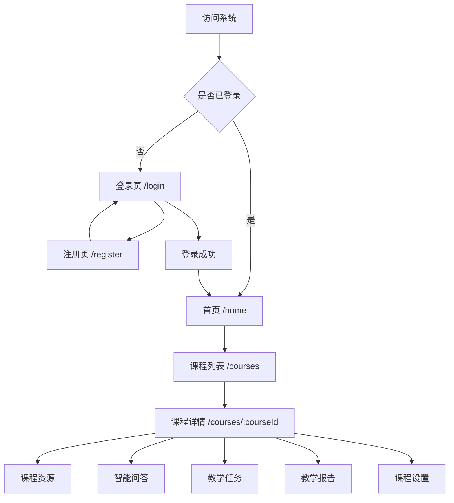
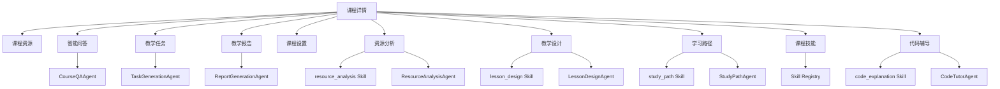
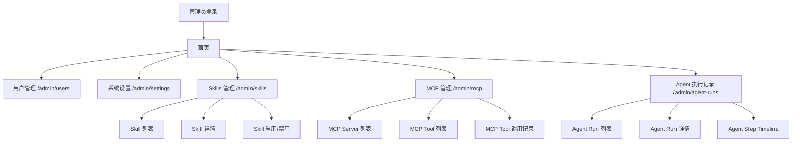
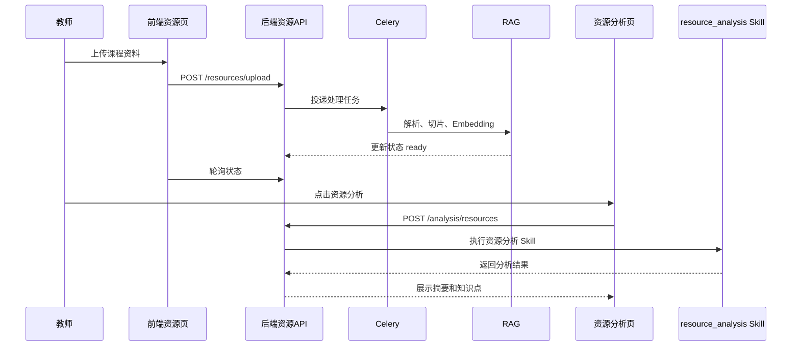
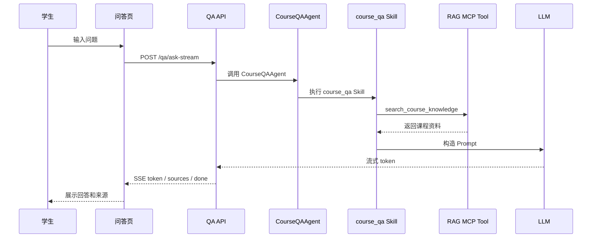
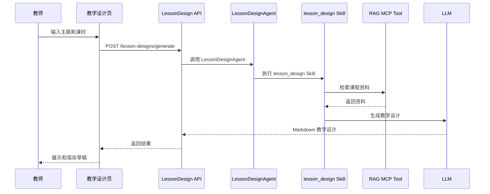
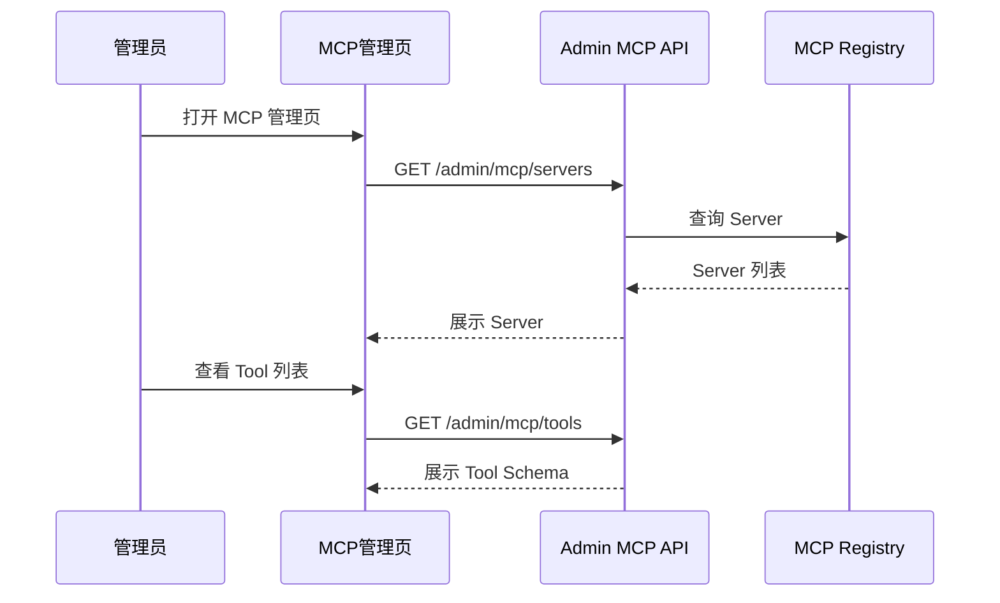
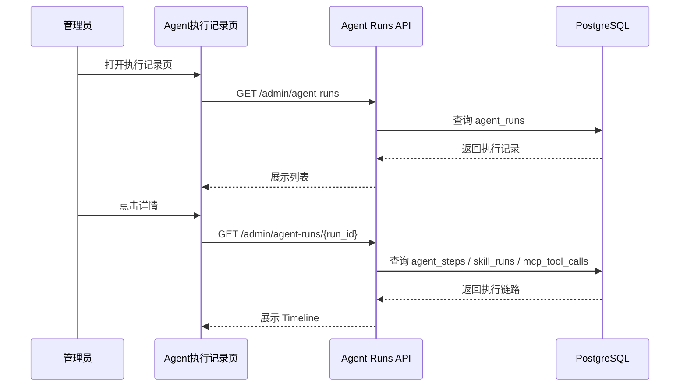

# 07 页面流程图与前端页面设计规范

> 项目名称：EduAgent 课程资源与教学任务智能体
> 文档类型：前端页面流程、路由设计、权限控制、智能体平台页面规划文档
> 适用对象：CodeBuddy / AI 编程助手 / 前端开发 / 后端开发 / Agent 开发 / MCP 开发 / Skills 开发 / 测试人员
> 对应代码：`frontend/src/router/`、`frontend/src/views/`、`frontend/src/components/`、`frontend/src/api/`、`frontend/src/stores/`、`frontend/src/types/`
> 文档版本：v2.0
> 优化日期：2026-06-10

------

## 1. 文档目的

本文档用于定义 EduAgent 项目的前端页面结构、路由设计、页面流转、角色权限、课程内导航、管理员导航、智能体平台页面规划、API 对接关系和前端验收标准。

新版 EduAgent 已经从普通课程 RAG 问答系统升级为：

```text
课程智能体平台
= 课程业务系统
+ RAG 知识库
+ MCP 工具生态
+ Skills 技能系统
+ Agent Orchestrator
+ 多智能体协作
+ 前端可视化管理页面
```

因此，前端页面不应只包含：

```text
课程资源
智能问答
教学任务
教学报告
课程设置
```

还应逐步扩展为：

```text
课程资源分析
教学设计
学习路径
课程技能
Skills 管理
MCP 管理
Agent 执行记录
代码辅导
智能体能力配置
```

本文档重点回答：

1. 当前已有页面有哪些。
2. 当前路由结构是什么。
3. 新版智能体平台需要新增哪些页面。
4. 学生、教师、管理员分别能访问哪些页面。
5. 页面与 API 如何对应。
6. 页面与 Agent / Skills / MCP 如何对应。
7. CodeBuddy 修改前端时必须遵守哪些约束。

------

## 2. 当前前端技术栈

当前项目使用：

| 技术            | 作用                |
| --------------- | ------------------- |
| Vue 3           | 前端框架            |
| TypeScript      | 静态类型            |
| Vite            | 构建工具            |
| Vue Router      | 路由和权限守卫      |
| Pinia           | 状态管理            |
| Axios           | HTTP 请求           |
| Tailwind CSS    | 页面样式            |
| marked          | Markdown 渲染       |
| DOMPurify       | HTML 清理，防止 XSS |
| lucide-vue-next | 图标库              |

注意：

1. 当前项目没有正式使用 `shadcn-vue`。
2. 当前项目没有正式使用 `Naive UI`。
3. 当前 Markdown 渲染使用 `marked + DOMPurify`。
4. 新增页面应继续使用当前技术栈，不得擅自引入大型 UI 框架。
5. 新增图标优先使用 `lucide-vue-next`，避免继续扩散 Emoji 标题。

------

## 3. 当前前端目录结构

```text
frontend/src/
├── api/
│   ├── client.ts
│   ├── admin.ts
│   ├── qa.ts
│   ├── reports.ts
│   ├── resources.ts
│   └── tasks.ts
│
├── components/
│   ├── common/
│   ├── layout/
│   └── markdown/
│
├── composables/
├── router/
│   └── index.ts
│
├── stores/
│   ├── auth.ts
│   ├── course.ts
│   └── toast.ts
│
├── types/
│   └── index.ts
│
└── views/
    ├── LoginView.vue
    ├── RegisterView.vue
    ├── HomeView.vue
    ├── CoursesView.vue
    ├── CourseDetailView.vue
    ├── CourseResourcesView.vue
    ├── CourseQAView.vue
    ├── CourseTasksView.vue
    ├── TaskDetailView.vue
    ├── CourseReportsView.vue
    ├── ReportDetailView.vue
    ├── CourseSettingsView.vue
    ├── ProfileView.vue
    ├── NotFoundView.vue
    └── admin/
        ├── AdminUsersView.vue
        └── AdminSettingsView.vue
```

------

## 4. 建议新增前端目录

为了支持新版智能体平台，建议新增：

```text
frontend/src/api/
├── skills.ts
├── mcp.ts
├── agent.ts
├── analysis.ts
├── lessonDesigns.ts
├── studyPath.ts
└── codeTutor.ts

frontend/src/views/
├── CourseAnalysisView.vue
├── CourseLessonDesignView.vue
├── CourseStudyPathView.vue
├── CourseSkillsView.vue
├── CourseCodeTutorView.vue
└── admin/
    ├── AdminSkillsView.vue
    ├── AdminMCPView.vue
    └── AdminAgentRunsView.vue

frontend/src/components/agent/
├── AgentRunTimeline.vue
├── SkillCallCard.vue
├── MCPToolCallCard.vue
└── AgentTracePanel.vue

frontend/src/components/skills/
├── SkillCard.vue
├── SkillRunStatus.vue
└── SkillResultRenderer.vue

frontend/src/components/mcp/
├── MCPServerCard.vue
├── MCPToolCard.vue
└── MCPToolCallTable.vue
```

------

## 5. 全局页面流转

### 5.1 基础页面流转



------

### 5.2 新版智能体平台页面流转



------

### 5.3 管理员页面流转



------

## 6. 当前路由表

### 6.1 公开路由

| 路径        | 页面               | 说明     |
| ----------- | ------------------ | -------- |
| `/login`    | `LoginView.vue`    | 登录页   |
| `/register` | `RegisterView.vue` | 注册页   |
| `/404`      | `NotFoundView.vue` | 404 页面 |

------

### 6.2 登录后通用路由

| 路径       | 页面              | 说明     |
| ---------- | ----------------- | -------- |
| `/home`    | `HomeView.vue`    | 首页     |
| `/courses` | `CoursesView.vue` | 课程列表 |
| `/profile` | `ProfileView.vue` | 个人中心 |

------

### 6.3 当前课程内路由

| 路径                                   | 页面                      | 角色          |
| -------------------------------------- | ------------------------- | ------------- |
| `/courses/:courseId/resources`         | `CourseResourcesView.vue` | 课程成员      |
| `/courses/:courseId/qa`                | `CourseQAView.vue`        | 课程成员      |
| `/courses/:courseId/tasks`             | `CourseTasksView.vue`     | 课程成员      |
| `/courses/:courseId/tasks/:taskId`     | `TaskDetailView.vue`      | 课程成员      |
| `/courses/:courseId/reports`           | `CourseReportsView.vue`   | 教师 / 管理员 |
| `/courses/:courseId/reports/:reportId` | `ReportDetailView.vue`    | 教师 / 管理员 |
| `/courses/:courseId/settings`          | `CourseSettingsView.vue`  | 教师 / 管理员 |

------

### 6.4 当前管理员路由

| 路径              | 页面                          | 角色   |
| ----------------- | ----------------------------- | ------ |
| `/admin/users`    | `admin/AdminUsersView.vue`    | 管理员 |
| `/admin/settings` | `admin/AdminSettingsView.vue` | 管理员 |

------

## 7. 建议新增路由

### 7.1 课程内智能体页面

| 路径                               | 页面                         | 角色                 | 功能                    |
| ---------------------------------- | ---------------------------- | -------------------- | ----------------------- |
| `/courses/:courseId/analysis`      | `CourseAnalysisView.vue`     | 教师 / 管理员        | 课程资源分析            |
| `/courses/:courseId/lesson-design` | `CourseLessonDesignView.vue` | 教师 / 管理员        | 教学设计生成            |
| `/courses/:courseId/study-path`    | `CourseStudyPathView.vue`    | 学生 / 教师 / 管理员 | 学习路径推荐            |
| `/courses/:courseId/skills`        | `CourseSkillsView.vue`       | 课程成员             | 当前课程可用 Skills     |
| `/courses/:courseId/code-tutor`    | `CourseCodeTutorView.vue`    | 课程成员             | 代码解释和错误分析      |
| `/courses/:courseId/agent-runs`    | `CourseAgentRunsView.vue`    | 教师 / 管理员        | 当前课程 Agent 执行记录 |

------

### 7.2 管理员智能体平台页面

| 路径                    | 页面                        | 角色   | 功能                   |
| ----------------------- | --------------------------- | ------ | ---------------------- |
| `/admin/skills`         | `AdminSkillsView.vue`       | 管理员 | Skills 管理            |
| `/admin/mcp`            | `AdminMCPView.vue`          | 管理员 | MCP Server / Tool 管理 |
| `/admin/agent-runs`     | `AdminAgentRunsView.vue`    | 管理员 | 全局 Agent 执行记录    |
| `/admin/mcp/tool-calls` | `AdminMCPToolCallsView.vue` | 管理员 | MCP Tool 调用记录      |
| `/admin/skills/runs`    | `AdminSkillRunsView.vue`    | 管理员 | Skill 执行记录         |

------

### 7.3 推荐最终路由结构

```text
/login
/register
/home
/courses
/profile

/courses/:courseId
/courses/:courseId/resources
/courses/:courseId/qa
/courses/:courseId/tasks
/courses/:courseId/tasks/:taskId
/courses/:courseId/reports
/courses/:courseId/reports/:reportId
/courses/:courseId/settings

/courses/:courseId/analysis
/courses/:courseId/lesson-design
/courses/:courseId/study-path
/courses/:courseId/skills
/courses/:courseId/code-tutor
/courses/:courseId/agent-runs

/admin/users
/admin/settings
/admin/skills
/admin/mcp
/admin/mcp/tool-calls
/admin/agent-runs
/admin/skills/runs

/404
```

------

## 8. 路由守卫设计

### 8.1 当前路由守卫

当前路由守卫应支持：

1. 未登录用户访问受保护页面，跳转 `/login`。
2. 已登录用户访问 `/login` 或 `/register`，跳转 `/home`。
3. 页面需要角色时，检查 `meta.roles`。
4. 页面需要课程权限时，根据课程角色判断。
5. token 存在但用户信息为空时，调用 `fetchMe()` 恢复用户状态。

------

### 8.2 新增智能体页面守卫

新增页面应配置：

```typescript
{
  path: 'analysis',
  name: 'course-analysis',
  component: () => import('@/views/CourseAnalysisView.vue'),
  meta: {
    requiresAuth: true,
    roles: ['teacher', 'admin'],
    requiresCourseRole: ['teacher']
  }
}
```

规则：

1. 资源分析页：教师 / 管理员。
2. 教学设计页：教师 / 管理员。
3. 学习路径页：学生、教师、管理员，但数据范围不同。
4. 课程技能页：课程成员。
5. 代码辅导页：课程成员。
6. 课程 Agent 执行记录页：教师 / 管理员。
7. 管理员 Skills / MCP / Agent 页面：仅管理员。

------

### 8.3 权限判断原则

前端权限只用于：

1. 隐藏不可用菜单。
2. 阻止无权限页面跳转。
3. 提升用户体验。

后端仍必须最终校验：

1. JWT。
2. 用户角色。
3. 课程成员身份。
4. 课程教师身份。
5. 管理员身份。
6. Skill 权限。
7. MCP 权限。

------

## 9. 全局布局设计

### 9.1 AppLayout

当前主布局：

```text
AppLayout
├── AppHeader
├── AppSidebar
├── Main Content
└── Toast
```

课程内页面应显示课程侧边栏。

非课程页面不显示课程侧边栏。

------

### 9.2 AppHeader

Header 应包含：

1. 系统 Logo。
2. 当前用户信息。
3. 用户角色。
4. 个人中心入口。
5. 退出登录。
6. 管理员入口，管理员可见。

------

### 9.3 AppSidebar

课程内侧边栏应包含基础菜单和智能体菜单。

#### 基础菜单

| 菜单     | 路由         | 角色          |
| -------- | ------------ | ------------- |
| 课程资源 | `/resources` | 课程成员      |
| 智能问答 | `/qa`        | 课程成员      |
| 教学任务 | `/tasks`     | 课程成员      |
| 教学报告 | `/reports`   | 教师 / 管理员 |
| 课程设置 | `/settings`  | 教师 / 管理员 |

#### 智能体菜单

| 菜单     | 路由             | 角色          |
| -------- | ---------------- | ------------- |
| 资源分析 | `/analysis`      | 教师 / 管理员 |
| 教学设计 | `/lesson-design` | 教师 / 管理员 |
| 学习路径 | `/study-path`    | 课程成员      |
| 代码辅导 | `/code-tutor`    | 课程成员      |
| 课程技能 | `/skills`        | 课程成员      |
| 执行记录 | `/agent-runs`    | 教师 / 管理员 |

------

### 9.4 移动端导航

移动端不应展示过多 Tab。

建议移动端保留核心 Tab：

```text
资源
问答
任务
更多
```

`更多` 中展示：

```text
报告
资源分析
教学设计
学习路径
代码辅导
课程技能
课程设置
```

------

## 10. 页面详细设计

------

# 10.1 LoginView 登录页

路径：

```text
/login
```

功能：

1. 输入用户名或邮箱。
2. 输入密码。
3. 登录。
4. 跳转注册页。
5. 登录成功后保存 access_token、refresh_token、user。
6. 登录失败显示错误信息。

API：

```text
POST /api/v1/auth/login
```

当前必须修复：

```text
后端登录接口必须返回 refresh_token，否则前端自动刷新链路不可用。
```

------

# 10.2 RegisterView 注册页

路径：

```text
/register
```

功能：

1. 输入用户名。
2. 输入邮箱。
3. 输入密码。
4. 选择角色：学生 / 教师。
5. 注册成功后跳转登录页。

API：

```text
POST /api/v1/auth/register
```

限制：

1. 普通用户不能注册管理员账号。
2. 密码必须符合最小安全要求。

------

# 10.3 HomeView 首页

路径：

```text
/home
```

功能：

1. 展示欢迎信息。
2. 展示最近课程。
3. 展示快捷入口。
4. 管理员展示管理入口。
5. 教师展示创建课程入口。
6. 学生展示加入课程入口。

新版建议增加：

1. “智能体能力概览”卡片。
2. “最近 Agent 执行状态”教师可见。
3. “我的学习路径”学生可见。
4. “资源分析待处理”教师可见。

------

# 10.4 CoursesView 课程列表页

路径：

```text
/courses
```

功能：

1. 展示课程列表。
2. 教师创建课程。
3. 学生加入课程。
4. 搜索课程。
5. 进入课程详情。

API：

```text
GET /api/v1/courses
POST /api/v1/courses
POST /api/v1/courses/join
```

------

# 10.5 CourseDetailView 课程容器页

路径：

```text
/courses/:courseId
```

功能：

1. 加载课程详情。
2. 加载当前用户在课程中的角色。
3. 渲染课程子路由。
4. 控制课程侧边栏。

当前建议修复：

```text
直接访问 /courses/:courseId 时，应默认重定向到 /courses/:courseId/resources。
```

推荐：

```text
/courses/:courseId → /courses/:courseId/resources
```

------

# 10.6 CourseResourcesView 课程资源页

路径：

```text
/courses/:courseId/resources
```

角色：

```text
课程成员可查看
教师 / 管理员可上传和删除
```

功能：

1. 展示资源列表。
2. 筛选文件类型。
3. 筛选处理状态。
4. 搜索资源。
5. 单文件上传。
6. 批量上传。
7. 状态轮询。
8. 删除资源。
9. 重新处理资源。

API：

```text
GET /api/v1/courses/{course_id}/resources
POST /api/v1/courses/{course_id}/resources/upload
POST /api/v1/courses/{course_id}/resources/upload-batch
GET /api/v1/courses/{course_id}/resources/{resource_id}/status
POST /api/v1/courses/{course_id}/resources/{resource_id}/reprocess
DELETE /api/v1/courses/{course_id}/resources/{resource_id}
```

当前必须修复：

```text
前端批量上传路径必须从 /batch-upload 改为 /upload-batch。
```

新版建议增加入口：

1. 单个资源“分析”按钮。
2. 多选资源“批量分析”按钮。
3. 点击后跳转或调用 `CourseAnalysisView`。

------

# 10.7 CourseQAView 智能问答页

路径：

```text
/courses/:courseId/qa
```

角色：

```text
课程成员
```

功能：

1. 输入问题。
2. 非流式或流式问答。
3. 展示 AI 回答。
4. 展示引用来源。
5. 展示历史问答。
6. 新建对话。
7. 清空对话上下文。
8. 点赞 / 点踩。
9. 停止生成。

API：

```text
POST /api/v1/courses/{course_id}/qa/ask
POST /api/v1/courses/{course_id}/qa/ask-stream
GET /api/v1/courses/{course_id}/qa/history
POST /api/v1/courses/{course_id}/qa/history/{qa_id}/feedback
DELETE /api/v1/courses/{course_id}/qa/conversation/{conversation_id}
```

智能体链路：

```text
CourseQAView
→ QA API
→ CourseQAAgent
→ course_qa Skill
→ RAG MCP Tool
→ LLM
```

页面要求：

1. 资料不足时显示提示。
2. sources 必须可点击或可展开。
3. 学生作业请求时，提示“提供思路，不直接给完整答案”。
4. SSE 事件要支持 thinking、sources、token、done、error。
5. 错误状态要可恢复。

------

# 10.8 CourseTasksView 教学任务页

路径：

```text
/courses/:courseId/tasks
```

角色：

```text
课程成员可查看
教师 / 管理员可生成、发布、归档、删除
```

功能：

1. 展示任务列表。
2. 按状态筛选。
3. 按任务类型筛选。
4. 教师生成任务。
5. 教师发布任务。
6. 教师归档任务。
7. 教师删除任务。
8. 学生只查看已发布任务。

API：

```text
GET /api/v1/courses/{course_id}/tasks
POST /api/v1/courses/{course_id}/tasks/generate
POST /api/v1/courses/{course_id}/tasks/{task_id}/publish
POST /api/v1/courses/{course_id}/tasks/{task_id}/archive
DELETE /api/v1/courses/{course_id}/tasks/{task_id}
```

当前必须修复：

```text
前端字段 extra_instructions 必须统一为 additional_instructions。
```

智能体链路：

```text
CourseTasksView
→ Task API
→ TaskGenerationAgent
→ task_generation Skill
→ RAG MCP Tool
→ LLM
```

新版建议：

1. 增加“生成测验题”入口。
2. 增加“基于资源生成任务”入口。
3. 增加“选择 Skill 类型”高级选项。

------

# 10.9 TaskDetailView 任务详情页

路径：

```text
/courses/:courseId/tasks/:taskId
```

功能：

1. 展示任务标题。
2. 展示 Markdown 内容。
3. 展示参考资源。
4. 教师编辑任务。
5. 教师重新生成任务。
6. 教师发布任务。
7. 教师删除任务。
8. 学生查看任务。

API：

```text
GET /api/v1/courses/{course_id}/tasks/{task_id}
PATCH /api/v1/courses/{course_id}/tasks/{task_id}
POST /api/v1/courses/{course_id}/tasks/{task_id}/regenerate
```

要求：

1. Markdown 使用 `MarkdownRenderer`。
2. 删除操作必须二次确认。
3. 学生不能看到编辑按钮。

------

# 10.10 CourseReportsView 教学报告页

路径：

```text
/courses/:courseId/reports
```

角色：

```text
课程教师 / 管理员
```

功能：

1. 展示报告列表。
2. 按报告类型筛选。
3. 生成报告。
4. 查看报告详情。
5. 导出报告。

API：

```text
GET /api/v1/courses/{course_id}/reports
POST /api/v1/courses/{course_id}/reports/generate
GET /api/v1/courses/{course_id}/reports/{report_id}/export
```

当前注意：

```text
如果后端没有 DELETE /reports/{report_id}，前端不应展示删除报告按钮。
```

智能体链路：

```text
CourseReportsView
→ Report API
→ ReportGenerationAgent
→ report_generation Skill
→ Course DB MCP Tool
→ Report Analysis MCP Tool
→ LLM
```

------

# 10.11 ReportDetailView 报告详情页

路径：

```text
/courses/:courseId/reports/:reportId
```

功能：

1. 展示报告标题。
2. 展示报告类型。
3. 展示日期范围。
4. 展示统计数据。
5. 展示 Markdown 报告。
6. 导出 Markdown。
7. 导出 PDF，后续增强。

API：

```text
GET /api/v1/courses/{course_id}/reports/{report_id}
GET /api/v1/courses/{course_id}/reports/{report_id}/export
```

要求：

1. 报告数字必须来自后端 statistics。
2. PDF 导出失败时应提示“当前 PDF 导出为实验能力”。
3. Markdown 渲染必须安全。

------

# 10.12 CourseSettingsView 课程设置页

路径：

```text
/courses/:courseId/settings
```

角色：

```text
课程教师 / 管理员
```

功能：

1. 修改课程信息。
2. 复制课程码。
3. 查看成员。
4. 添加成员。
5. 移除成员。
6. 删除课程。

API：

```text
GET /api/v1/courses/{course_id}
PATCH /api/v1/courses/{course_id}
GET /api/v1/courses/{course_id}/members
POST /api/v1/courses/{course_id}/members
DELETE /api/v1/courses/{course_id}/members/{member_id}
DELETE /api/v1/courses/{course_id}
```

------

# 10.13 CourseAnalysisView 课程资源分析页，新增

路径：

```text
/courses/:courseId/analysis
```

角色：

```text
课程教师 / 管理员
```

对应能力：

```text
ResourceAnalysisAgent
resource_analysis Skill
File Resource MCP Tool
RAG MCP Tool
```

功能：

1. 选择资源。
2. 选择分析类型。
3. 生成资源摘要。
4. 提取知识点。
5. 分析资源难度。
6. 检测重复内容。
7. 检测缺失知识点。
8. 给出教学建议。
9. 查看历史分析记录。

分析类型：

```text
summary
knowledge_points
quality_check
gap_analysis
```

API：

```text
POST /api/v1/courses/{course_id}/analysis/resources
GET /api/v1/courses/{course_id}/analysis/resources
GET /api/v1/courses/{course_id}/analysis/resources/{analysis_id}
```

页面状态：

| 状态    | 展示                   |
| ------- | ---------------------- |
| empty   | 暂无可分析资源         |
| loading | 正在分析资源           |
| success | 展示摘要、知识点、建议 |
| failed  | 展示失败原因和重试按钮 |

------

# 10.14 CourseLessonDesignView 教学设计页，新增

路径：

```text
/courses/:courseId/lesson-design
```

角色：

```text
课程教师 / 管理员
```

对应能力：

```text
LessonDesignAgent
lesson_design Skill
RAG MCP Tool
```

功能：

1. 输入教学主题。
2. 输入课时长度。
3. 选择学生水平。
4. 输入教学目标。
5. 输入额外要求。
6. 生成教学设计。
7. 预览 Markdown。
8. 保存草稿。
9. 查看历史教学设计。
10. 编辑和删除教学设计。

API：

```text
POST /api/v1/courses/{course_id}/lesson-designs/generate
GET /api/v1/courses/{course_id}/lesson-designs
GET /api/v1/courses/{course_id}/lesson-designs/{lesson_design_id}
PATCH /api/v1/courses/{course_id}/lesson-designs/{lesson_design_id}
DELETE /api/v1/courses/{course_id}/lesson-designs/{lesson_design_id}
```

输出内容：

```text
教学目标
教学重点
教学难点
教学准备
教学流程
课堂活动
课堂练习
教学评价
课后任务
```

------

# 10.15 CourseStudyPathView 学习路径页，新增

路径：

```text
/courses/:courseId/study-path
```

角色：

```text
学生 / 教师 / 管理员
```

对应能力：

```text
StudyPathAgent
study_path Skill
Course DB MCP Tool
RAG MCP Tool
```

学生侧功能：

1. 输入目标知识点。
2. 生成自己的学习路径。
3. 查看推荐资源。
4. 查看学习步骤。
5. 查看练习建议。
6. 查看历史学习路径。

教师侧功能：

1. 查看课程学习路径概览。
2. 查看聚合薄弱点。
3. 不直接展示学生隐私问答全文。

API：

```text
POST /api/v1/courses/{course_id}/study-path/generate
GET /api/v1/courses/{course_id}/study-path/my
GET /api/v1/courses/{course_id}/study-path/overview
```

权限要求：

1. 学生只能查看自己的学习路径。
2. 教师只能查看聚合数据或授权范围数据。
3. 不得泄露其他学生隐私。

------

# 10.16 CourseSkillsView 课程技能页，新增

路径：

```text
/courses/:courseId/skills
```

角色：

```text
课程成员
```

功能：

1. 展示当前用户在当前课程可用 Skills。
2. 展示每个 Skill 的说明。
3. 展示 Skill 输入要求。
4. 展示 Skill 使用入口。
5. 学生只看到学生可用技能。
6. 教师看到教学类技能。

API：

```text
GET /api/v1/skills
GET /api/v1/skills/{skill_name}
POST /api/v1/skills/{skill_name}/run
```

展示 Skill：

| Skill             | 学生   | 教师   |
| ----------------- | ------ | ------ |
| course_qa         | ✅      | ✅      |
| code_explanation  | ✅ 受限 | ✅      |
| study_path        | ✅      | ✅ 聚合 |
| resource_analysis | ❌      | ✅      |
| task_generation   | ❌      | ✅      |
| report_generation | ❌      | ✅      |
| lesson_design     | ❌      | ✅      |
| quiz_generation   | ❌      | ✅      |

------

# 10.17 CourseCodeTutorView 代码辅导页，新增

路径：

```text
/courses/:courseId/code-tutor
```

角色：

```text
课程成员
```

对应能力：

```text
CodeTutorAgent
code_explanation Skill
Code Sandbox MCP Tool，可选
```

功能：

1. 输入代码。
2. 选择语言。
3. 输入问题。
4. 解释代码。
5. 分析报错。
6. 生成学习建议。
7. 教师侧可生成测试用例，后续能力。
8. 代码运行默认关闭或受限。

API：

```text
POST /api/v1/courses/{course_id}/code-tutor/explain
POST /api/v1/courses/{course_id}/code-tutor/debug
POST /api/v1/courses/{course_id}/code-tutor/run
```

安全要求：

1. 学生侧不得直接获得完整作业答案。
2. 代码运行必须沙箱化。
3. 默认不允许危险命令。
4. 默认不允许网络访问。
5. 页面必须提示代码执行风险。

------

# 10.18 CourseAgentRunsView 课程执行记录页，新增

路径：

```text
/courses/:courseId/agent-runs
```

角色：

```text
课程教师 / 管理员
```

功能：

1. 查看当前课程 Agent 执行记录。
2. 按 Agent 类型筛选。
3. 按状态筛选。
4. 查看执行步骤。
5. 查看 Skill 调用摘要。
6. 查看 MCP Tool 调用摘要。
7. 查看错误原因。
8. 不展示敏感 Prompt 和密钥。

API：

```text
GET /api/v1/courses/{course_id}/agent-runs
GET /api/v1/courses/{course_id}/agent-runs/{run_id}
```

组件：

```text
AgentRunTimeline
SkillCallCard
MCPToolCallCard
AgentTracePanel
```

------

# 10.19 AdminUsersView 用户管理页

路径：

```text
/admin/users
```

角色：

```text
管理员
```

功能：

1. 用户列表。
2. 按角色筛选。
3. 按状态筛选。
4. 搜索用户。
5. 创建用户。
6. 启用 / 禁用用户。
7. 修改角色。

API：

```text
GET /api/v1/admin/users
POST /api/v1/admin/users
PATCH /api/v1/admin/users/{user_id}
```

当前必须修复：

```text
前端 updateUser 使用 JSON Body。
后端应统一接收 JSON Body。
```

------

# 10.20 AdminSettingsView 系统设置页

路径：

```text
/admin/settings
```

角色：

```text
管理员
```

功能：

1. 查看系统配置。
2. 查看模型配置脱敏信息。
3. 查看上传限制。
4. 查看 RAG 配置。
5. 查看 Agent / MCP / Skills 配置。

API：

```text
GET /api/v1/admin/settings
PUT /api/v1/admin/settings
```

安全要求：

1. 不显示真实 API Key。
2. 不显示 JWT Secret。
3. 不显示数据库密码。
4. 只显示脱敏配置。

------

# 10.21 AdminSkillsView Skills 管理页，新增

路径：

```text
/admin/skills
```

角色：

```text
管理员
```

功能：

1. 查看 Skill 列表。
2. 查看 Skill 名称、描述、版本、启用状态。
3. 查看输入输出 Schema。
4. 启用或禁用 Skill。
5. 查看 Skill 执行记录入口。
6. 查看 Skill 文档入口。

API：

```text
GET /api/v1/skills
GET /api/v1/skills/{skill_name}
GET /api/v1/skills/runs
GET /api/v1/skills/runs/{run_id}
```

如后续支持 Skill 管理：

```text
PATCH /api/v1/admin/skills/{skill_name}
```

------

# 10.22 AdminMCPView MCP 管理页，新增

路径：

```text
/admin/mcp
```

角色：

```text
管理员
```

功能：

1. 查看 MCP Server 列表。
2. 查看 MCP Tool 列表。
3. 查看 Server 状态。
4. 启用 / 禁用 Server。
5. 查看 Tool Schema。
6. 查看 Tool 调用记录入口。

API：

```text
GET /api/v1/admin/mcp/servers
POST /api/v1/admin/mcp/servers
PATCH /api/v1/admin/mcp/servers/{server_id}
DELETE /api/v1/admin/mcp/servers/{server_id}
GET /api/v1/admin/mcp/tools
GET /api/v1/admin/mcp/tool-calls
```

安全要求：

1. 不显示真实密钥。
2. 不允许前端直接配置高风险密钥。
3. 高风险工具必须有明显提示。
4. 删除 Server 优先改为禁用。

------

# 10.23 AdminAgentRunsView Agent 执行记录页，新增

路径：

```text
/admin/agent-runs
```

角色：

```text
管理员
```

功能：

1. 查看全局 Agent 执行记录。
2. 按课程筛选。
3. 按用户筛选。
4. 按 Agent 类型筛选。
5. 按状态筛选。
6. 查看执行详情。
7. 查看步骤 Timeline。
8. 查看失败原因。
9. 查看 Skill / MCP 调用摘要。
10. 不展示敏感 Prompt。

API：

```text
GET /api/v1/admin/agent-runs
GET /api/v1/admin/agent-runs/{run_id}
```

------

## 11. 页面权限矩阵

| 页面            | 学生     | 教师       | 管理员     |
| --------------- | -------- | ---------- | ---------- |
| 登录页          | ✅        | ✅          | ✅          |
| 注册页          | ✅        | ✅          | ❌ 普通注册 |
| 首页            | ✅        | ✅          | ✅          |
| 课程列表        | ✅        | ✅          | ✅          |
| 课程资源        | ✅ 查看   | ✅ 管理     | ✅          |
| 智能问答        | ✅        | ✅          | ✅          |
| 教学任务        | ✅ 已发布 | ✅ 全部     | ✅          |
| 任务详情        | ✅ 已发布 | ✅ 全部     | ✅          |
| 教学报告        | ❌        | ✅          | ✅          |
| 报告详情        | ❌        | ✅          | ✅          |
| 课程设置        | ❌        | ✅          | ✅          |
| 资源分析        | ❌        | ✅          | ✅          |
| 教学设计        | ❌        | ✅          | ✅          |
| 学习路径        | ✅ 自己   | ✅ 聚合     | ✅          |
| 代码辅导        | ✅ 受限   | ✅          | ✅          |
| 课程技能        | ✅ 可用   | ✅ 可用     | ✅          |
| 课程执行记录    | ❌        | ✅ 当前课程 | ✅          |
| 用户管理        | ❌        | ❌          | ✅          |
| 系统设置        | ❌        | ❌          | ✅          |
| Skills 管理     | ❌        | ❌          | ✅          |
| MCP 管理        | ❌        | ❌          | ✅          |
| 全局 Agent 记录 | ❌        | ❌          | ✅          |

------

## 12. 前端 API 封装关系

### 12.1 当前 API 文件

| 文件           | 对应后端                                |
| -------------- | --------------------------------------- |
| `client.ts`    | Axios 实例、Token 注入、Token 刷新      |
| `admin.ts`     | `/api/v1/admin`                         |
| `qa.ts`        | `/api/v1/courses/{course_id}/qa`        |
| `reports.ts`   | `/api/v1/courses/{course_id}/reports`   |
| `resources.ts` | `/api/v1/courses/{course_id}/resources` |
| `tasks.ts`     | `/api/v1/courses/{course_id}/tasks`     |

------

### 12.2 建议新增 API 文件

| 文件               | 对应后端                                                     |
| ------------------ | ------------------------------------------------------------ |
| `skills.ts`        | `/api/v1/skills`                                             |
| `mcp.ts`           | `/api/v1/admin/mcp`                                          |
| `agent.ts`         | `/api/v1/admin/agent-runs`、`/api/v1/courses/{course_id}/agent-runs` |
| `analysis.ts`      | `/api/v1/courses/{course_id}/analysis`                       |
| `lessonDesigns.ts` | `/api/v1/courses/{course_id}/lesson-designs`                 |
| `studyPath.ts`     | `/api/v1/courses/{course_id}/study-path`                     |
| `codeTutor.ts`     | `/api/v1/courses/{course_id}/code-tutor`                     |

------

## 13. 前端类型设计

建议在 `frontend/src/types/index.ts` 中新增：

```text
SkillMetadata
SkillRun
MCPServer
MCPTool
MCPToolCall
AgentRun
AgentStep
ResourceAnalysisResult
LessonDesign
StudyPath
CodeTutorResult
```

------

### 13.1 SkillMetadata

```typescript
export interface SkillMetadata {
  name: string
  display_name: string
  description: string
  version?: string
  enabled: boolean
  allowed_roles: UserRole[]
  input_schema?: Record<string, unknown>
  output_schema?: Record<string, unknown>
}
```

------

### 13.2 AgentRun

```typescript
export interface AgentRun {
  id: string
  agent_type: string
  course_id?: string
  user_id?: string
  conversation_id?: string
  intent?: string
  selected_skill?: string
  status: 'pending' | 'running' | 'success' | 'failed' | 'cancelled'
  step_count: number
  latency_ms?: number
  error_message?: string
  created_at: string
}
```

------

### 13.3 MCPToolCall

```typescript
export interface MCPToolCall {
  id: string
  server_name: string
  tool_name: string
  course_id?: string
  user_id?: string
  status: 'pending' | 'running' | 'success' | 'failed' | 'timeout' | 'denied'
  latency_ms?: number
  error_message?: string
  created_at: string
}
```

------

## 14. 页面状态设计

每个页面都必须处理四类状态：

```text
loading
empty
error
normal
```

------

### 14.1 loading

用于：

1. 首次加载页面。
2. API 请求中。
3. 资源分析中。
4. 教学设计生成中。
5. 学习路径生成中。
6. Agent 执行记录加载中。

组件：

```text
LoadingSpinner
```

------

### 14.2 empty

用于：

1. 无课程。
2. 无资源。
3. 无任务。
4. 无报告。
5. 无 Skill 执行记录。
6. 无 MCP 调用记录。
7. 无 Agent 执行记录。

组件：

```text
EmptyState
```

------

### 14.3 error

用于：

1. API 请求失败。
2. 无权限。
3. 资源处理失败。
4. AI 生成失败。
5. MCP Tool 调用失败。
6. Skill 执行失败。
7. Agent 执行失败。

要求：

1. 显示用户可理解的错误。
2. 不展示内部异常堆栈。
3. 提供重试按钮。
4. 对权限错误提示返回上一页。

------

### 14.4 normal

用于展示正常数据。

------

## 15. 关键业务流程图

### 15.1 资源上传与分析流程



------

### 15.2 智能问答流程



------

### 15.3 教学设计生成流程



------

### 15.4 MCP 管理流程



------

### 15.5 Agent 执行记录查看流程



------

## 16. 设计系统规范

### 16.1 色彩

建议继续使用当前 Tailwind + CSS Variables 方案。

常用状态色：

| 状态    | 用途                         |
| ------- | ---------------------------- |
| primary | 主要按钮、导航高亮           |
| success | 成功、ready、published       |
| warning | parsing、chunking、embedding |
| danger  | failed、删除、禁用           |
| muted   | 辅助文字、空状态             |
| border  | 卡片边框                     |

------

### 16.2 图标

优先使用 `lucide-vue-next`。

推荐图标：

| 页面 / 功能 | 图标            |
| ----------- | --------------- |
| 课程资源    | `FolderOpen`    |
| 智能问答    | `MessageCircle` |
| 教学任务    | `ClipboardList` |
| 教学报告    | `BarChart3`     |
| 课程设置    | `Settings`      |
| 资源分析    | `FileSearch`    |
| 教学设计    | `BookOpenCheck` |
| 学习路径    | `Route`         |
| 代码辅导    | `Code2`         |
| 课程技能    | `Sparkles`      |
| Skills 管理 | `Wand2`         |
| MCP 管理    | `PlugZap`       |
| Agent 记录  | `Workflow`      |

------

### 16.3 Markdown 渲染

所有 AI 生成内容必须使用：

```text
MarkdownRenderer
```

要求：

1. 使用 `marked` 转 HTML。
2. 使用 `DOMPurify` 清理。
3. 支持代码块。
4. 支持表格。
5. 支持标题。
6. 防止 XSS。

适用页面：

1. 智能问答。
2. 任务详情。
3. 报告详情。
4. 教学设计。
5. 代码辅导。
6. 资源分析结果。

------

## 17. 当前前端必须修复问题

| 优先级 | 问题                          | 文件                                                    | 修复建议                                            |
| ------ | ----------------------------- | ------------------------------------------------------- | --------------------------------------------------- |
| P0     | 批量上传路径错误              | `api/resources.ts`                                      | 改为 `/upload-batch`                                |
| P0     | 任务生成字段错误              | `api/tasks.ts`、`CourseTasksView.vue`、`types/index.ts` | `extra_instructions` 改为 `additional_instructions` |
| P0     | Token 刷新依赖缺失            | `client.ts`、`auth.ts`                                  | 后端登录返回 refresh_token，前端保存                |
| P1     | 课程详情默认空白              | `router/index.ts`                                       | `/courses/:courseId` 重定向 `/resources`            |
| P1     | 报告删除按钮无接口            | `CourseReportsView.vue`                                 | 移除按钮或后端补 DELETE                             |
| P1     | Admin 更新用户参数不一致      | `api/admin.ts`、后端 API                                | 统一 JSON Body                                      |
| P1     | Emoji 标题未完全替换          | 各 views                                                | 新增或修改页面使用 Lucide                           |
| P1     | Agent / Skills / MCP 页面缺失 | views / router / api                                    | 分阶段新增                                          |

------

## 18. 前端开发顺序建议

### 18.1 第一阶段：修复现有页面

```text
1. 修复批量上传路径
2. 修复任务字段
3. 修复 Token 刷新
4. 修复课程详情默认重定向
5. 修复报告删除按钮
6. 修复管理员更新用户
```

------

### 18.2 第二阶段：新增 Skills 和 Agent 类型

```text
1. 新增 types：SkillMetadata、SkillRun、AgentRun、AgentStep、MCPToolCall
2. 新增 api：skills.ts、agent.ts、mcp.ts
3. 新增通用组件：AgentRunTimeline、SkillCallCard、MCPToolCallCard
```

------

### 18.3 第三阶段：新增课程智能体页面

```text
1. CourseAnalysisView
2. CourseLessonDesignView
3. CourseStudyPathView
4. CourseSkillsView
5. CourseCodeTutorView
6. CourseAgentRunsView
```

------

### 18.4 第四阶段：新增管理员智能体页面

```text
1. AdminSkillsView
2. AdminMCPView
3. AdminAgentRunsView
4. AdminMCPToolCallsView
5. AdminSkillRunsView
```

------

## 19. 前端验收标准

### 19.1 基础页面验收

| 编号     | 验收项     | 通过标准                      |
| -------- | ---------- | ----------------------------- |
| FE-AC-01 | 登录页     | 登录成功后跳转首页            |
| FE-AC-02 | 注册页     | 注册成功后跳转登录页          |
| FE-AC-03 | Token 刷新 | access_token 过期后可刷新     |
| FE-AC-04 | 课程列表   | 可创建和加入课程              |
| FE-AC-05 | 课程详情   | 默认重定向资源页              |
| FE-AC-06 | 资源页     | 上传、批量上传、状态轮询正常  |
| FE-AC-07 | 问答页     | SSE 正常显示 token 和 sources |
| FE-AC-08 | 任务页     | 教师可生成，学生只读已发布    |
| FE-AC-09 | 报告页     | 教师可生成和导出 Markdown     |
| FE-AC-10 | 课程设置   | 教师可管理成员和课程信息      |

------

### 19.2 智能体平台页面验收

| 编号     | 验收项           | 通过标准                                 |
| -------- | ---------------- | ---------------------------------------- |
| AG-FE-01 | 资源分析页       | 教师可分析资源摘要和知识点               |
| AG-FE-02 | 教学设计页       | 教师可生成教学设计                       |
| AG-FE-03 | 学习路径页       | 学生可生成自己的学习路径                 |
| AG-FE-04 | 代码辅导页       | 学生可获得代码解释                       |
| AG-FE-05 | 课程技能页       | 按角色展示可用 Skills                    |
| AG-FE-06 | 课程执行记录     | 教师可查看当前课程 Agent 记录            |
| AG-FE-07 | Skills 管理页    | 管理员可查看 Skills                      |
| AG-FE-08 | MCP 管理页       | 管理员可查看 MCP Server / Tool           |
| AG-FE-09 | Agent 执行记录页 | 管理员可查看执行链路                     |
| AG-FE-10 | 敏感信息         | 页面不展示 API Key、JWT、完整系统 Prompt |

------

### 19.3 权限验收

| 编号       | 验收项               | 通过标准            |
| ---------- | -------------------- | ------------------- |
| AUTH-FE-01 | 未登录访问           | 跳转 `/login`       |
| AUTH-FE-02 | 学生访问报告         | 跳转 403 或隐藏入口 |
| AUTH-FE-03 | 学生访问课程设置     | 隐藏入口并阻止访问  |
| AUTH-FE-04 | 学生访问资源分析     | 隐藏入口并阻止访问  |
| AUTH-FE-05 | 学生访问教学设计     | 隐藏入口并阻止访问  |
| AUTH-FE-06 | 学生访问 admin       | 跳转 404 或 403     |
| AUTH-FE-07 | 教师访问其他课程记录 | 后端返回 403        |
| AUTH-FE-08 | 管理员访问管理页     | 正常访问            |

------

## 20. CodeBuddy 前端开发要求

CodeBuddy 修改前端时必须遵守：

1. 不得重建前端项目。
2. 不得替换 Vue 3 技术栈。
3. 不得引入未确认 UI 框架。
4. API 调用必须写入 `frontend/src/api/`。
5. 类型必须写入 `frontend/src/types/`。
6. 新页面必须加入路由。
7. 新路由必须配置权限。
8. 新菜单必须按角色显示。
9. 所有 AI Markdown 内容必须使用 MarkdownRenderer。
10. 所有删除操作必须使用 ConfirmDialog。
11. 所有页面必须有 loading、empty、error、normal 状态。
12. 所有后端字段变更必须同步前端类型。
13. 不得在前端保存模型 API Key。
14. 不得在前端显示完整系统 Prompt。
15. 不得在前端暴露 MCP Tool 的敏感参数。
16. 新增智能体页面必须与 `04_API接口文档.md` 对齐。
17. 新增页面必须同步本文档。

------

## 21. 本文档总结

EduAgent 前端页面需要从当前的基础课程系统页面：

```text
课程资源
智能问答
教学任务
教学报告
课程设置
用户管理
系统设置
```

逐步升级为课程智能体平台页面体系：

```text
课程资源分析
教学设计
学习路径
代码辅导
课程技能
Agent 执行记录
Skills 管理
MCP 管理
MCP Tool 调用记录
Skill 执行记录
```

当前优先级是：

```text
1. 先修复现有前端 API 字段和路径问题
2. 再补充智能体平台所需 TypeScript 类型
3. 再新增 Skills / MCP / Agent API 封装
4. 再新增课程内智能体页面
5. 最后新增管理员智能体平台页面
```

完成这些页面后，EduAgent 才能在前端层面真正体现：

```text
课程业务系统
+ RAG 问答
+ MCP 工具生态
+ Skills 技能系统
+ 多智能体协作
+ 执行审计可视化
```